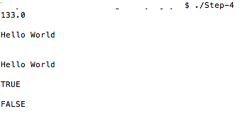

#SLANG FOR SWIFT-4

##The Art of Compiler Construction using SWIFT-4


####CHAPTER – 4

###Types, Variables and Assignment Statement

In this step , we will support data types and variables to SLANG. Assignment statement will also be implemented in this step. 

The language supports only three data types

NUMERIC 

STRING 

BOOLEAN 

Let us add an enum for data types 

```Swift
public enum TypeInfo{

    case illegal
    case numeric
    case bool
    case string
}
```
Every variable will have a name, type and a slot for storing its value in the symbol table. Moreover, Functions return SymbolInfo. 

```Swift
public struct SymbolInfo{

    var name:String
    var type:TypeInfo
    var double:Double
    var bool:Bool
    var string:String
}
```
The next step is to modify the Expression and Statement classes to reflect the variable support. 

```Swift
public class Expression {
    
    init() { }
    func evaluate( _ irContext:RuntimeContext?) throws -> SymbolInfo? { return nil }
    func typeCheck(_ icContext:CompilationContext?) throws -> TypeInfo { return .illegal}
    func getType()-> TypeInfo {
        return .illegal
    }
}
```

The class RunTime context contains the Symbol Table during interpretation. 

```Swift
public class RuntimeContext {
    
    public var sybolTable:SymbolTable?
    public init() {
      sybolTable = SymbolTable()
    }
}

public class CompilationContext{
    
    public var sybolTable:SymbolTable?
    public init() {
        sybolTable = SymbolTable()
    }
}
```

Let us write the code for BooleanConstant node. This will store TRUE or FALSE value. 

```Swift
public class BooleanConstant:Expression{
    
    private var symbolInfo:SymbolInfo? = nil
    private var type:TypeInfo = .illegal

    init( _ iValue:Bool){
        symbolInfo = SymbolInfo()
        symbolInfo?.bool = iValue
        symbolInfo?.type = .bool
    }
    
    override func evaluate( _ irContext:RuntimeContext?)->SymbolInfo? {
        
        return symbolInfo
    }
    
    override func typeCheck(_ icContext:CompilationContext?) throws -> TypeInfo {
        
        type = symbolInfo?.type ?? .illegal
        return type
    }
    
    override func getType()-> TypeInfo {

        return type
    }
}
```
The next thing, which we should support, is NumericConstant. This will store a IEEE 754 double precision floating point value. 

```Swift
public class NumericConstant:Expression{
    
    private var symbolInfo:SymbolInfo? = nil
    private var type:TypeInfo = .illegal
    
    init( _ iValue:Double){
        symbolInfo = SymbolInfo()
        symbolInfo?.double = iValue
        symbolInfo?.type = .numeric
    }
    
    override func evaluate( _ irContext:RuntimeContext?)->SymbolInfo? {
        
        return symbolInfo
    }
    
    override func typeCheck(_ icContext:CompilationContext?)throws -> TypeInfo {
        
        type = symbolInfo?.type ?? .illegal
        return type
    }
    
    override func getType()-> TypeInfo {
        
        return type
    }
}
```

The AST node for storing String Literal is as given below 

```Swift
public class StringLitteral:Expression{
   
    private var symbolInfo:SymbolInfo? = nil
    private var type:TypeInfo = .illegal
    
    init( _ iValue:String){
        symbolInfo = SymbolInfo()
        symbolInfo?.string = iValue
        symbolInfo?.type = .string
    }
    
    override func evaluate( _ irContext:RuntimeContext?)->SymbolInfo? {
        
        return symbolInfo
    }
    
    override func typeCheck(_ icContext:CompilationContext?)throws -> TypeInfo {
        
        type = symbolInfo?.type ?? .illegal

        return type
    }
    
    override func getType()-> TypeInfo {
        
        return type
    }
}
```
Adding support to variable is an involved activity. 

```Swift
public class Variable:Expression{
    
    public var name:String = ""
    private var type:TypeInfo = .illegal
    
    init( _ symbolInfo:SymbolInfo){
        self.name = symbolInfo.name
    }
    
    init( _ icContext:CompilationContext , _ iName:String , _ iValue:Double){
        
        let symbolInfo = SymbolInfo()
        symbolInfo.name = iName
        symbolInfo.type = .numeric
        symbolInfo.double = iValue
        icContext.sybolTable?.add(symbolInfo)
        self.name = iName
    }
    
    init( _ icContext:CompilationContext , _ iName:String , _ iValue:Bool){
        
        let symbolInfo = SymbolInfo()
        symbolInfo.name = iName
        symbolInfo.type = .bool
        symbolInfo.bool = iValue
        icContext.sybolTable?.add(symbolInfo)
        self.name = iName
    }
    
    init( _ icContext:CompilationContext , _ iName:String , _ iValue:String){
        
        let symbolInfo = SymbolInfo()
        symbolInfo.name = iName
        symbolInfo.type = .string
        symbolInfo.string = iValue
        icContext.sybolTable?.add(symbolInfo)
        self.name = iName
    }
    
    override func evaluate( _ irContext:RuntimeContext?)->SymbolInfo? {
        
        return irContext?.sybolTable?.get(name) ?? nil
    }
    
    override func typeCheck(_ icContext:CompilationContext?) throws-> TypeInfo {
        
        type = icContext?.sybolTable?.get(name).type ?? .illegal
        
        return type
    }
    
    override func getType()-> TypeInfo {

        return type
    }
}
```
At this point of time Expression hierarchy ( without operators ) looks like as follows 

*	**Expression class**
*	**BooleanConstant class**
*	**NumericConstant class**
*	**StringLiteral class**
*	**Variable  class**

Once we have created nodes to represents constants of the type which we are planning to support , we created a variable node. The next challenge is to add support for the operators. Till now , I had UnaryExp and BinaryExp. For clarity, I will have classes like Plus ( + ) , Minus (-) , Div ( / ) and Mul ( *) for BinaryExp and will have classes UnaryPlus ( + ) , UnaryMinus ( -) for Unary operators 

The first operator to be supported is Binary + 

```Swift
public class BinaryPlus:Expression{
    
    private var exp1:Expression?
    private var exp2:Expression?
    private var type:TypeInfo = .illegal
    
    init( _ iExp1:Expression , _ iExp2:Expression){

        self.exp1 = iExp1
        self.exp2 = iExp2
    }
    
    override func evaluate( _ irContext:RuntimeContext?) throws ->SymbolInfo? {
        
        let evalLeft = try exp1?.evaluate(irContext)
        let rightLeft = try exp2?.evaluate(irContext)
        
        if evalLeft?.type == .numeric && rightLeft?.type == .numeric {
            let retSymbolInfo = SymbolInfo()
            retSymbolInfo.type = .numeric
            retSymbolInfo.double = (evalLeft?.double)! + (rightLeft?.double)!
            
            return retSymbolInfo
        }else if evalLeft?.type == .string && rightLeft?.type == .string {
            let retSymbolInfo = SymbolInfo()
            retSymbolInfo.type = .string
            retSymbolInfo.string = (evalLeft?.string)! + (rightLeft?.string)!
            
            return retSymbolInfo
        }else{
            throw SlangError.typeMismatchError
        }
    }
    
    override func typeCheck(_ icContext:CompilationContext?) throws -> TypeInfo {
        
        let leftType = try exp1?.typeCheck(icContext)
        let rightType = try exp1?.typeCheck(icContext)
        if leftType == rightType && (leftType == .numeric ||  leftType == .string) {
            type = leftType!
            
            return type
        }else{
            throw SlangError.typeMismatchError
        }
    }
    
    override func getType()-> TypeInfo {
     
        return type
    }
}
```
Where as Evaluate routine for StringLiteral, NumericConstant, BooleanConstant and Variable just involves returning the SymbolInfo, in the case of Operators things are bit evolved... 

In the above code snippet, Left and Right expressions are evaluated and the types are queried. In our compiler, operations involving numerics and strings are successful only if all the operands are of the same type. 

The routine TypeCheck is similar to Evaluate. Only difference is that TypeCheck updates the type information of the nodes in a Recursive manner. The routine getType is only valid once you have 
called typeCheck routine. 

BinaryMinus is similar to BinaryPlus. The only difference is only Numerics can be subtracted. 

```Swift
public class BinaryMinus:Expression{
    
    private var exp1:Expression?
    private var exp2:Expression?
    private var type:TypeInfo = .illegal
    
    init( _ iExp1:Expression , _ iExp2:Expression){
        self.exp1 = iExp1
        self.exp2 = iExp2
    }
    
    override func evaluate( _ irContext:RuntimeContext?) throws ->SymbolInfo? {
        
        let evalLeft = try exp1?.evaluate(irContext)
        let rightLeft = try exp2?.evaluate(irContext)
        
        if evalLeft?.type == .numeric && rightLeft?.type == .numeric {
            let retSymbolInfo = SymbolInfo()
            retSymbolInfo.type = .numeric
            retSymbolInfo.double = (evalLeft?.double)! - (rightLeft?.double)!
            
            return retSymbolInfo
        }else{
            throw SlangError.typeMismatchError
        }
    }
    
    override func typeCheck(_ icContext:CompilationContext?) throws -> TypeInfo {
        
        let leftType = try exp1?.typeCheck(icContext)
        let rightType = try exp1?.typeCheck(icContext)
        if leftType == rightType && leftType == .numeric {
            type = leftType!
            
            return type
        }else{
            throw SlangError.typeMismatchError
        }
    }
    
    override func getType()-> TypeInfo {
        
        return type
    }
}
```
Multiplication and Division operators are only valid for Numeric Types. If you have understood the implementation of BinaryPlus , the Multiplication and Division operators are easy to follow 

**Multiplication:**

```Swift
public class Multiplication:Expression{
    
    private var exp1:Expression?
    private var exp2:Expression?
    private var type:TypeInfo = .illegal
    
    init( _ iExp1:Expression , _ iExp2:Expression){
        self.exp1 = iExp1
        self.exp2 = iExp2
    }
    
    override func evaluate( _ irContext:RuntimeContext?) throws ->SymbolInfo? {
        
        let evalLeft = try exp1?.evaluate(irContext)
        let rightLeft = try exp2?.evaluate(irContext)
        
        if evalLeft?.type == .numeric && rightLeft?.type == .numeric {
            let retSymbolInfo = SymbolInfo()
            retSymbolInfo.type = .numeric
            retSymbolInfo.double = (evalLeft?.double)! * (rightLeft?.double)!
            
            return retSymbolInfo
        }else{
            throw SlangError.typeMismatchError
        }
    }
    
    override func typeCheck(_ icContext:CompilationContext?) throws -> TypeInfo {
        
        let leftType = try exp1?.typeCheck(icContext)
        let rightType = try exp1?.typeCheck(icContext)
        if leftType == rightType && leftType == .numeric {
            type = leftType!
            
            return type
        }else{
            throw SlangError.typeMismatchError
        }
    }
    
    override func getType()-> TypeInfo {
        
        return type
    }
}
```

**Division**

```Swift
public class Division:Expression{
    
    private var exp1:Expression?
    private var exp2:Expression?
    private var type:TypeInfo = .illegal
    
    init( _ iExp1:Expression , _ iExp2:Expression){
        self.exp1 = iExp1
        self.exp2 = iExp2
    }
    
    override func evaluate( _ irContext:RuntimeContext?) throws ->SymbolInfo? {
        
        let evalLeft = try exp1?.evaluate(irContext)
        let rightLeft = try exp2?.evaluate(irContext)
        
        if evalLeft?.type == .numeric && rightLeft?.type == .numeric {
            let retSymbolInfo = SymbolInfo()
            retSymbolInfo.type = .numeric
            retSymbolInfo.double = (evalLeft?.double)! / (rightLeft?.double)!
            
            return retSymbolInfo
        }else{
            throw SlangError.typeMismatchError
        }
    }
    
    override func typeCheck(_ icContext:CompilationContext?) throws -> TypeInfo {
        
        let leftType = try exp1?.typeCheck(icContext)
        let rightType = try exp1?.typeCheck(icContext)
        if leftType == rightType && leftType == .numeric {
            type = leftType!
            
            return type
        }else{
            throw SlangError.typeMismatchError
        }
    }
    
    override func getType()-> TypeInfo {
        
        return type
    }
}
```

UnaryPlus and UnaryMinus is also similar to the implementation of other operators. Both these operators are only applicable for Numeric data type. 

```Swift
public class UnaryPlus:Expression{
    
    private var exp:Expression?
    private var type:TypeInfo = .illegal
    
    init(_ iExp:Expression ){
        self.exp = iExp
    }
    
    override func evaluate( _ irContext:RuntimeContext?) throws ->SymbolInfo? {
        
        let eval = try exp?.evaluate(irContext)
        
        if eval?.type == .numeric{
            let retSymbolInfo = SymbolInfo()
            retSymbolInfo.type = .numeric
            retSymbolInfo.double = (eval?.double)!
            
            return retSymbolInfo
        }else{
            throw SlangError.typeMismatchError
        }
    }
    
    override func typeCheck(_ icContext:CompilationContext?) throws -> TypeInfo {
        
        let leftType = try exp?.typeCheck(icContext)
        
        if leftType == .numeric {
            type = leftType!
            
            return type
        }else{
            throw SlangError.typeMismatchError
        }
    }
    
    override func getType()-> TypeInfo {
        
        return type
    }
}

public class UnaryMinus:Expression{
    
    private var exp:Expression?
    private var type:TypeInfo = .illegal
    
    init(_ iExp:Expression ){
        self.exp = iExp
    }
    
    override func evaluate( _ irContext:RuntimeContext?) throws ->SymbolInfo? {
        
        let eval = try exp?.evaluate(irContext)
        
        if eval?.type == .numeric{
            let retSymbolInfo = SymbolInfo()
            retSymbolInfo.type = .numeric
            retSymbolInfo.double = -(eval?.double)!
            
            return retSymbolInfo
        }else{
            throw SlangError.typeMismatchError
        }
    }
    
    override func typeCheck(_ icContext:CompilationContext?) throws -> TypeInfo {
        
        let leftType = try exp?.typeCheck(icContext)
        
        if leftType == .numeric {
            type = leftType!
            
            return type
        }else{
            throw SlangError.typeMismatchError
        }
    }
    
    override func getType()-> TypeInfo {
        
        return type
    }
}
```

The statement related nodes are moved to a separate module by the name AstForStatements. In this step, we have added support for Variable Declaration and Assignment statement. The AST for Variable declaration is given below

```Swift
public class VariableDeclStatement:Statement{
    
    var symblInfo:SymbolInfo? =  nil
    var variable:Variable? = nil
    
    init(_ iSymbolInfo:SymbolInfo){
        self.symblInfo = iSymbolInfo
    }
    
    override public func execute( _ irContext:RuntimeContext?)throws ->SymbolInfo?{
        
        irContext?.sybolTable?.add(symblInfo!)
        variable = Variable(symblInfo!)
        
        return nil
    }
}
```
In the parser, before we create ‘VariableDeclStatement’ node, we need to insert the variable's SYMBOL_INFO into the ‘SymbolTable’ of the ‘CompilationCOntext’.

The ‘VariableDeclStatement’ node just stores the variable name in the Variable AST. While Executing the VariableDeclStatement , a Variable is created in the Symbol table of ‘RuntimeContext’.

Both Compilation Context (CompilationCOntext’ ) and Run time Context (RuntimeContext ) just contains references to respective symbol tables. 

The AST for Assignment statement is given below 

```Swift
public class AssignmentStatement:Statement{

    private var variable:Variable?
    private var exp:Expression?
    
    init(_ iVariable:Variable , _ iExp:Expression){
        variable = iVariable
        exp = iExp
    }
    
    init(_ iSymbolInfo:SymbolInfo ,_ iExp:Expression){
        variable = Variable(iSymbolInfo)
        exp = iExp
    }
    
    override public func execute( _ irContext:RuntimeContext?)throws ->SymbolInfo?{
        
        guard let tempSymbol = try exp?.evaluate(irContext) else{
            throw SlangError.undefinedSymbol
        }
        irContext?.sybolTable?.assign(variable!, tempSymbol)
            
        return nil
    }
}
```

At this point of time , AST for Statements is as shown below 
*	**Statement class**

*	**VariableDeclStatement class**

*	**AssignmentStatement class**

*	**PrintStatement class**

*	**PrintLineStatement class**

The class SymbolTable is just a vector of name/value pair. The source code of the SymbolTable is given below. 

```Swift
public class SymbolInfo{
    
    var name:String = ""
    var type:TypeInfo = .illegal
    var double:Double = 0.0
    var bool:Bool = false
    var string:String = ""
}

public class SymbolTable{
    
    private var table:[String:SymbolInfo] = [String:SymbolInfo]()
    
    public func add(_ symbolInfo:SymbolInfo){
        table[symbolInfo.name] = symbolInfo
    }
    
    public func get(_ iName:String)->SymbolInfo{
        
        return table[iName]!
    }
    
    public func assign(_ iVariable:Variable , _ iInfo:SymbolInfo ){
        iInfo.name = iVariable.name
        table[iInfo.name] = iInfo
    }
    
    public func assign(_ iName:String , _ iInfo:SymbolInfo ){
        
        table[iName] = iInfo
    }
    
    
}
```

The class CsyntaxErrorLog and CsemanticErrorLog ( in SlangError.swift) is meant for error logging while the compilation process is going on..... 

Let us go back to Lexical Analysis stage once again. This time we have added lot of new keywords to the language and Token set has become bit larger than the previous step. 

```Swift
public enum Token{
    
    case illegal
    case plus
    case minus
    case times
    case divide
    case oParen
    case cParen
    
    case null
    case print
    case println
    case unquotedString
    case semi
    
    case varNumber
    case varString
    case varBool
    case numeric
    case comment
    case boolTrue
    case boolFalse
    case string
    case assign
}
```
We have also moved couple of routines and state variables to ‘Lexer’ class. The two notable additions are 

```Swift
    var currentToken:Token = .illegal
    var lastToken:Token = .illegal
```

Since we have added support for string type, we need to support string literals ( or the last grabbed string ) in the lexical analyzer.

```Swift
	var lastStr:String = ""
```	
	
	We need to update the keyword table with additional key words supported by the compiler 
	
```Swift
private var keyWords = [
                                ValueTable( .boolTrue,"TRUE"),
                                ValueTable( .boolFalse,"FALSE"),
                                ValueTable( .varBool,"BOOLEAN"),
                                ValueTable( .varString,"STRING"),
                                ValueTable( .varNumber,"NUMERIC"),
                                ValueTable( .print,"PRINT"),
                                ValueTable(.println,"PRINTLINE")
                            ]
```

The Parsing of the statements starts from parse Routine of RDParser.cs 

```Swift
public func parse(_ icContext:CompilationContext?)->[Statement]{
        getNextToken()
        
        return getStatementList(icContext)
    }
```

Any variable encountered during the parse process will be put into the symbol table associated with Compilation Context. 

The Logic of the getStatementList is as follows, while there are more statements, parse and add Statements to the array 

The Grammar supported is given below

	<stmtlist> := { <statement> }+ /// 

	{<statement> := <printstmt> | <printlinestmt> 

	<printstmt> := print <expr >; 

	<vardeclstmt> := STRING <varname>; | 

	NUMERIC <varname>; | 

	BOOLEAN <varname>; /// 

	<printlinestmt>:= printline <expr>; /// 

	<Expr> ::= <Term> | <Term> { + | - } <Expr> 

	<Term> ::= <Factor> | <Factor> {*|/} <Term> 

	<Factor>::= <number> | ( <expr> ) | {+|-} <factor> 

	<variable> | TRUE | FALSE ///

```Swift
private func getStatementList(_ icContext:CompilationContext? )->[Statement]{
        
        var retStatements:[Statement] = [Statement]()
        while currentToken != .null{
            do{
                let temStmt = try getStatement(icContext)
                retStatements.append(temStmt!)
            }catch SlangError.invalidExpression{
                print(SlangError.invalidExpression.discription)
            }catch{
                print("Unknown error")
            }
        }
        
        return retStatements
    }
```
The Statement method just queries the statement type and calls the appropriate Parse Routines 

```Swift
private func getStatement( _ icContext:CompilationContext? ) throws ->Statement?{
        
        var retVal:Statement? = nil
        switch currentToken {
            case .varNumber, .varBool , .varString:
                retVal = try parseVariableDeclStatement(icContext)
                getNextToken()
            case .print:
                retVal = try parsePrintStatement(icContext)
                getNextToken()
            case .println:
                retVal = try parsePrintlnStatement(icContext)
                getNextToken()
            case .unquotedString:
                retVal = try parseAssignmentStatement(icContext)
                getNextToken()
            default:
                print("Invalid statement")
                throw SlangError.invalidExpression
        }
        
        return retVal
 }
```
The Source code of the parseVariableDeclStatement is as given below 

```Swift
func parseVariableDeclStatement(_ icContext:CompilationContext?) throws ->Statement{
        
        getNextToken()
        if currentToken == .unquotedString{
            let sInfo = SymbolInfo()
            sInfo.name = lastStr
            sInfo.type = lastToken == .varBool ? .bool : (lastToken == .varNumber ? .numeric :.string )
            getNextToken()
            if currentToken == .semi{
                icContext?.sybolTable?.add(sInfo)
                return VariableDeclStatement(sInfo)
            }else{
                SyntaxErrorLog.addLine("; expected")
                SyntaxErrorLog.addLine(getCurrentLine(index))
                throw ParserException(-100, ", or ; expected", index)
            }
		   }else{
            SyntaxErrorLog.addLine("invalid variable declaration");
            SyntaxErrorLog.addLine(getCurrentLine(index));
            throw ParserException(-100, ", or ; expected", index);
        }
}
```

Assignment statement is easy to parse as the required ground work has already been done... ! 

```Swift
private func parseAssignmentStatement(_ icContext:CompilationContext? ) throws ->Statement{
        
        guard let symbolInfo = icContext?.sybolTable?.get(lastStr) else{
            
            SyntaxErrorLog.addLine("Variable not found \(lastStr)")
            SyntaxErrorLog.addLine(getCurrentLine(index))
            throw ParserException(-100, "Variable not found",index)
        }
        getNextToken()
        if currentToken != .assign{
            SyntaxErrorLog.addLine("= expected")
            SyntaxErrorLog.addLine(getCurrentLine(index))
            throw ParserException(-100, "= expected", index)
        }
        getNextToken()
        
        let exp = try getExpression(icContext)
        let tp = try exp?.typeCheck(icContext)

        if tp != symbolInfo.type{
            throw SlangError.typeMismatchError
        }
        
        if currentToken != .semi{
            SyntaxErrorLog.addLine("= expected")
            SyntaxErrorLog.addLine(getCurrentLine(index))
            throw ParserException(-100, "= expected", index)
        }
        
        return AssignmentStatement(symbolInfo , exp!)
  }
```

**Parsing Expressions**

The grammar for expression is given below 

	<Expr> ::= <Term> | <Term> { + | - } <Expr> 
	<Term> ::= <Factor> | <Factor> {*|/} <Term> 
	<Factor>::= <number> | ( <expr> ) | {+|-} <factor> 
	<variable> | TRUE | FALSE 

Let us take a look at the Expression routine, ie the top most expression parsing routine at this point of time... (In future, when logical expressions and relational expressions are added, we modify the grammar) 

```Swift
private func getExpression( _ icContext:CompilationContext?) throws ->Expression?{

        var retVal:Expression? = try getTerm(icContext)
        while currentToken == .plus || currentToken == .minus{
            let lToken = currentToken
            getNextToken()
            let tempExp = try getExpression(icContext)
            if lToken == .plus{
                retVal = BinaryPlus(retVal!, tempExp!)
            }else if lToken == .minus{
                retVal = BinaryMinus(retVal!, tempExp!)
            }
        }
        
        return retVal
}
```
The Term routine handles the Multiplication and the Division operators 

```Swift
private func getTerm(_ icContext:CompilationContext?) throws ->Expression?{
       
        var retVal:Expression? = try getFactor(icContext)
        while currentToken == .times || currentToken == .divide{
            let lToken = currentToken
            getNextToken()
            let tempExp = try getTerm(icContext)
            if lToken == .times{
                retVal = Multiplication(retVal!, tempExp!)
            }else if lToken == .divide{
                retVal = Division(retVal!, retVal!)
            }
        }
        
        return retVal
}
```
The factor routine is where we handle Variables, unary Operations, Constants etc.. 

```Swift
private func getFactor(_ icContext:CompilationContext?) throws -> Expression?{
        
        var retVal:Expression? = nil
        
        if  currentToken == .numeric {
            retVal = NumericConstant(self.number)
            getNextToken()
        }else if currentToken == .string{
            retVal = StringLitteral(lastStr)
            getNextToken()
        }else if currentToken == .boolFalse || currentToken == .boolTrue{
            retVal = BooleanConstant( currentToken == .boolTrue ? true : false)
            getNextToken()
        }else if currentToken == .oParen{
            getNextToken()
            retVal = try getExpression(icContext)
            if currentToken != .cParen{
                print("Missing Closing Parenthesis")
                throw SlangError.missingParenthessis
            }
            getNextToken()
        }else if currentToken == .plus || currentToken == .minus {
            let lToken = currentToken
            getNextToken()
            retVal = try getFactor(icContext)
            if lToken == .plus{
                retVal = UnaryPlus(retVal!)
            }else if lToken == .minus{
                retVal = UnaryMinus(retVal!)
            }
        }else if currentToken == .unquotedString{
            
            guard let info = icContext?.sybolTable?.get(lastStr) else{
                throw SlangError.undefinedSymbol
            }
            getNextToken()
            retVal = Variable(info)
        }
        else{
            print("Illegal Token")
            throw SlangError.illegalToken
        }
        
        return retVal
}
```
This is how we need to invoke the Script. 

```Swift
let path1 = "path/to/script/First.sl"
let path2 = " path/to /Second.sl"
let path3 = " path/to /script/Third.sl"

let cContext = CompilationContext()
let rContext = RuntimeContext()

var slanfScript1 =  try? String(contentsOfFile: path1)
var rdParser1 = RDParser(slanfScript1!)
var stmts1 = rdParser1.parse(cContext)
for stmt in stmts1{
   _ = try? stmt.execute(rContext)
}

var slanfScript2 =  try? String(contentsOfFile: path2)
var rdParser2 = RDParser(slanfScript2!)
var stmts2 = rdParser2.parse(cContext)
for stmt in stmts2{
    _ = try? stmt.execute(rContext)
}

var slanfScript3 =  try? String(contentsOfFile: path3)
var rdParser3 = RDParser(slanfScript3!)
var stmts3 = rdParser3.parse(cContext)
for stmt in stmts3{
    _ = try? stmt.execute(rContext)
}
```
First.sl
```SLANG
///////////////////////////////////
//
// A simple SLANG script
//
//    Sample #1
//

NUMERIC a;   // Declare a Numeric variable

a = 2*3+5* 30 + -(4*5+3);  // Assign 

PRINTLINE a;  // Dump a 

//----- String concatenation

PRINT "Hello " + "World";

//-------------- Write a new line

PRINTLINE "";

//-------------- string data type

STRING c;
c = "Hello ";  // assignment to string 

//---------------- assignment and concatenation

C = C + "World";

PRINTLINE c;
//-------------- boolean variable 

BOOLEAN d;

d= TRUE;

PRINTLINE d;

d= FALSE;

PRINTLINE d;
```
```SLANG
Second.sl
//////////////////////////////////////
//
// A slang script to test unary expression
//
//
//
Numeric a ;
a = -1 ;
a = -a;
Print a;
```
```SLANG
Third.sl
///////////////////////

//

//

//

//

//
Numeric a;

String b

a = ---1;

PrintLine a*4 + 10;
```






[<= Chapter-3](../../Step-3/Chapter-3/Chapter-3.md)
